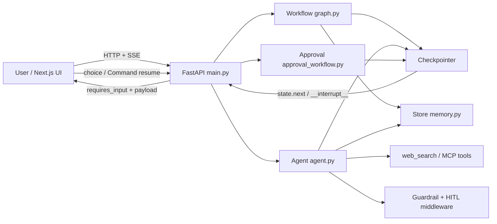

# LangGraph Interrupt Workflow Template 学习总路线

> [!abstract] 最终目标
> 在较短时间内把这个仓库从“能运行的开源模板”内化为你能独立解释、调试、改造、评测，并在面试中讲清楚取舍的项目。最终不应只是复述 README，而要能从一次请求开始，画出状态如何流动、何时持久化、如何中断、怎样恢复、失败如何降级，以及你会怎样把它改造成业务系统。

> [!important] 学习纪律
> 每个阶段必须留下四类证据：
> 1. 一份源码/架构 Markdown 笔记；
> 2. 一次可复现的运行 trace、日志或测试结果；
> 3. 一个小而明确的代码实验或改造；
> 4. 一段 60–120 秒的面试口述稿。
>
> 解释不是终点。每次学习都要完成：**预测 → 阅读 → 运行/验证 → 设计判断 → 复述**。

## 0. 先拷问你：开始前必须写下预测

请不要先查答案。把以下问题写在 `docs/learning/00-predictions.md`，每题只写你当前的模型和理由。

1. 用户第一次调用 `/start` 后，为什么不会直接得到最终答案？`graph.py` 中第一个 interrupt 发生在哪里？
2. `Command(resume=...)` 恢复时，LangGraph 是从头重新执行，还是从 checkpoint 继续？为什么 `thread_id` 是必要的？
3. `graph.py` 和 `agent.py` 的核心控制权分别在谁手里：代码还是模型？两者的 Human-in-the-loop 粒度有什么不同？
4. `query_planner` 为什么返回 `Command(goto=[Send(...)])`，而不是简单返回 `sub_queries` 再连接一个普通节点？
5. 并行 worker 都写入 `research_results` 时，为什么需要 `reset_or_append` reducer？如果去掉它会发生什么？
6. `main.py` 的 SSE `/stream` 为什么同时需要 `custom`、`messages`、`updates` 三种 stream mode？每种事件分别服务谁？
7. `MemorySaver`、`AsyncSqliteSaver`、LangGraph `Store` 分别解决什么问题？它们都算“记忆”吗？
8. Agent 的审批发生在 `web_search` 执行之前。若用户 reject，模型循环如何继续？如果没有 checkpointer 会怎样？
9. `approval_workflow.py` 为什么用 `MAX_REVISIONS`？“无限按反馈重写”在生产环境里有哪些坏情况？
10. 这个项目最像“工作流平台”“Agent 应用”还是“Human-in-the-loop Runtime 示例”？请给出你的判断标准。

> [!tip] 通过标准
> 预测不要求全对，但必须能说出因果链。不能只写“LangGraph 会处理”。你要明确指出：输入、状态字段、节点、边/路由、checkpoint、API 响应和下一步动作。

## 1. 先建立一张地图，不要从细节迷路

### 项目核心定位

这是一个**三引擎、共享基础设施、统一前端体验**的 Human-in-the-loop Agent 模板：

- **Workflow**：`backend/graph.py`，固定节点与固定 interrupt，适合多阶段决策、并行研究、可预测流程。
- **Agent**：`backend/agent.py`，`create_agent` 驱动模型循环，模型决定何时调用工具，middleware 在敏感工具前暂停。
- **Approval workflow**：`backend/approval_workflow.py`，先生成 draft，再由人 approve/edit/reject，reject 会回到重写节点。
- **Deep Agent**：`backend/deep_agent.py`，可选的规划、研究员/批评家子 Agent 与虚拟文件系统；放在前三条主线之后学习。

共享层：

- `llm.py`：provider-agnostic LLM 工厂 + offline mock model。
- `tools.py`：`web_search` 工具和流式进度。
- `memory.py`：跨 thread 的 Store 长期记忆。
- `guardrails.py`：PII 脱敏和 blocklist。
- `middleware_pack.py`：摘要、重试、调用限制、fallback、todo 规划。
- `mcp_tools.py`：可选 MCP 工具接入。
- `main.py`：FastAPI lifecycle、graphs、checkpoint、HTTP/SSE、time travel、能力发现。
- `frontend/app/page.tsx`：三引擎统一交互界面；`frontend/app/approval/page.tsx`：审批专用 UI。
- `backend/test_main.py`、`backend/evals/`、`.github/workflows/ci.yml`：行为证明、评测和持续集成。

### 总体数据流



### 三条主流程的最小心智模型

#### Workflow：代码控制流程

```text
/start
  → recall_memory
  → research_planner_interrupt  [暂停 1：选择 proceed/simplified/focused/cancel]
  → query_planner              [LLM 拆题]
  → Send(sub_researcher × N)   [并行研究 + reducer 聚合]
  → research_direction_interrupt [仅 comprehensive/proceed 时暂停]
  → deep_analyzer
  → format_selection_interrupt [暂停 3：选择输出格式]
  → response_generator
  → persist_memory
  → END
```

#### Agent：模型控制循环

```text
用户消息 → 模型决定调用 web_search
          → HumanInTheLoopMiddleware interrupt
          → 人 approve / edit / reject / respond
          → 工具执行（或被拒绝）
          → 模型继续循环并生成答案
```

#### Approval：内容发布门

```text
drafter → human_review interrupt
       ├─ approve → finalize
       ├─ edit    → 使用人工版本 → finalize
       └─ reject → feedback + revision_count → drafter（最多 3 次）
```

## 2. 推荐学习路线：8 个阶段，先主线后扩展

> 时间按每天 1.5–3 小时估算。若时间更紧，保留阶段 1–5 和阶段 8；不要先学所有可选功能。

| 阶段 | 建议用时 | 目标 | 必读文件 | 必做实验/证据 | Markdown 产出 | 面试资产 |
|---|---:|---|---|---|---|---|
| 1. 跑通与建图 | 0.5–1 天 | 知道服务怎么启动、一次请求如何走完 | `README.md`, `.env.example`, `langgraph.json`, `main.py` | mock 模式启动；调用 `/health`、`/capabilities`、`/start`；保存一组 `/start`→`/resume` 响应 | `docs/learning/01-runtime-map.md` | 30 秒项目总览 |
| 2. LangGraph 核心闭环 | 1 天 | 彻底理解 StateGraph、TypedDict、节点、边、interrupt、Command、checkpoint | `graph.py`, `main.py` 的 `/start` `/resume` | 手画并复述三次 interrupt；用测试跑通 `proceed → technical → executive` | `docs/source-reading/graph-workflow.md` | “为什么 interrupt 不是普通函数返回值？” |
| 3. 并行与流式 | 0.5–1 天 | 理解 `Send`、动态 fan-out、reducer、custom/messages/updates SSE | `graph.py`, `tools.py`, `main.py` stream handlers | 观察多 worker progress；设置 `RESEARCH_MAX_SUBQUERIES=1` 对比；记录事件顺序 | `docs/source-reading/parallel-streaming.md` | “如何避免并发结果互相覆盖？” |
| 4. Agent 与 Workflow 对照 | 1 天 | 掌握 `create_agent`、middleware、工具审批、模型驱动循环 | `agent.py`, `guardrails.py`, `middleware_pack.py` | CLI agent；测试 approve/edit/reject；切换 guardrail/middleware 环境变量 | `docs/architecture/workflow-vs-agent.md` | 用控制权、可预测性、扩展性比较两者 |
| 5. 审批、恢复与持久化 | 0.5–1 天 | 形成生产级 HITL 心智模型 | `approval_workflow.py`, `main.py`, `docs/DEPLOYMENT.md` | approve/edit/reject；比较 `MemorySaver` 和 SQLite；验证重启后的 thread 恢复 | `docs/source-reading/approval-and-durability.md` | “人类决策是状态机输入，不是 UI 附加功能” |
| 6. 记忆、时间旅行与安全 | 1 天 | 分清 checkpoint 与 Store；理解 fork、PII redaction、blocklist | `memory.py`, `guardrails.py`, `main.py` history/fork routes | 跨 thread memory；列 checkpoint；从旧 checkpoint fork；提交含邮箱/卡号的输入观察脱敏 | `docs/source-reading/memory-safety-time-travel.md` | 解释数据边界与风险，不把所有东西叫 memory |
| 7. Deep Agent、MCP、AG-UI | 1–1.5 天 | 学会识别可选复杂度，知道何时不该引入 | `deep_agent.py`, `mcp_tools.py`, `agui.py`, `examples/copilotkit` | 先读接口再启用；观察 capabilities；画出子 Agent/MCP 审批边界 | `docs/architecture/optional-engines.md` | “扩展点如何复用同一审批机制？” |
| 8. Evaluation 与简历资产化 | 1 天 | 能用指标证明系统行为，能讲 Bad Case 和取舍 | `backend/evals/*`, `docs/EVALUATION.md`, tests, CI | 离线 eval；新增 1 个业务样例和 1 个 evaluator；跑 pytest；写故障分析 | `docs/evaluation/first-regression-report.md`, `docs/bad-cases/first-bad-case.md` | STAR 项目故事 + 指标 + 失败案例 |

## 3. 每个阶段的学习动作模板

每次不要只“看完一个文件”，按下面顺序执行：

1. **预测**：写出控制流和你预计看到的状态字段。
2. **定位**：只读当前阶段文件，标出入口、核心函数、外部依赖和副作用。
3. **运行**：用 mock 先跑行为，不要一开始配置真实 API key。
4. **断点**：记录 interrupt payload、`state.next`、checkpoint/thread_id、SSE event。
5. **判断**：回答“这个设计为什么这样做？替代方案是什么？坏情况是什么？”
6. **微改造**：只改一个变量或一个节点行为，先加测试再改代码。
7. **复述**：不用打开源码，画图并用 90 秒讲清楚。

## 4. 第一周可直接执行的安排

### Day 1：环境与黑盒

- 运行 backend 测试，确认 mock 模型可用。
- 启动 FastAPI；访问 `/docs`、`/capabilities`。
- 记录 `/start` 返回的 `thread_id`、`requires_input`、`interrupt_message`、`next`。
- 不看 `graph.py` 细节，先根据现象写 `docs/learning/00-predictions.md`。

### Day 2：白盒 Workflow

- 读 `ResearchState` 和 `build_research_graph`。
- 把每个 node 的输入/输出/副作用填进表格。
- 跑完整 interrupt 流程并画状态转移图。

### Day 3：并发和事件

- 读 `query_planner`、`sub_researcher`、`reset_or_append`、`stream_research_response`。
- 保存一次 progress/content/state/done 事件样本。
- 思考并发、顺序、重复恢复和部分失败。

### Day 4：Agent 范式

- 读 `build_agent` 的 middleware 顺序。
- 跑 agent start/decide；对 approve、edit、reject 各写一条因果链。
- 写 Workflow vs Agent 对照，而不是只写 API 用法。

### Day 5：持久化和审批

- 读 `approval_workflow.py`。
- 运行 approve/edit/reject；验证 revision cap。
- 设置 `CHECKPOINT_DB`，重启服务并验证恢复能力。

### Day 6：安全、记忆、时间旅行

- 追 `recall_memory → persist_memory`。
- 观察 PII 是否在模型调用前被处理、原始 state 是否被改变。
- 运行 history/fork 测试并说明“原路径为何仍保留”。

### Day 7：评测与口述

- 运行离线 eval 和 pytest。
- 新增一个与你目标行业相关的 dataset case。
- 录音/写下 2 分钟项目介绍，必须包含一个设计取舍和一个 Bad Case。

## 5. 优先级：哪些先学，哪些暂时不碰

### P0：必须内化

- `interrupt` + `Command(resume=...)` + checkpointer。
- `thread_id`、`state.next`、`__interrupt__` 与 API/SSE 的映射。
- `graph.py` 的 StateGraph、`Send`、reducer 和三次人类决策。
- `agent.py` 的 `create_agent` + `HumanInTheLoopMiddleware`。
- `main.py` 的 lifecycle、路由和流式事件。
- 测试如何证明“暂停发生在工具执行前”。

### P1：形成生产判断

- SQLite durable execution 与 Store 长期记忆的区别。
- Guardrails、重试、timeout、compensation、call limits。
- time travel/fork 的语义和数据风险。
- eval 指标与 LangSmith experiment。

### P2：作为扩展面准备

- Deep Agent 的子 Agent/虚拟文件系统。
- MCP adapter 和 AG-UI/CopilotKit。
- 结构化输出和 semantic memory embeddings。

> [!warning] 暂时不要做
> 不要同时把 MCP、Deep Agent、RAG、复杂权限系统、生产数据库和新 UI 全部加进去。你当前的目标是建立因果链与可验证证据，而不是堆 feature。先能用 mock 解释并复现核心闭环，再选一个业务方向改造。

## 6. 建议的第一个改造：把模板变成你的业务项目

完成 P0 后，只选择一个业务场景，例如：

- 技术方案评审助手：研究 → 方案生成 → 架构师审批 → 发布。
- 客服回复审核助手：草稿 → 风险检查 → 人工编辑/拒绝 → 发送。
- 企业知识研究助手：问题拆解 → 检索 → 引用校验 → 人工确认。

改造边界建议：

1. 保留 `interrupt`、checkpoint、SSE 和评测骨架。
2. 替换 `ResearchState` 中的领域字段和 1 个工具。
3. 把 approval payload 改成领域对象，而不是泛化字符串。
4. 至少新增一个“必须暂停”的安全/质量不变量。
5. 新增 3 个离线 eval case：正常、工具审批、异常/拒绝。

这样面试时讲的是你的系统设计，而不是“我 clone 了一个模板”。

## 7. 面试叙事模板

> 我基于 LangGraph 实现了一个可恢复的 Human-in-the-loop AI workflow。系统同时提供确定性 StateGraph 和模型驱动 Agent 两种控制范式：前者在规划、方向和格式选择处显式 interrupt，后者通过 HumanInTheLoopMiddleware 在敏感工具调用前审批。FastAPI 使用 thread_id 映射 checkpoint，并通过 SSE 返回 progress、token 和 state 事件；Store 负责跨会话记忆，checkpoint 负责线程内恢复与 time travel。为了证明行为正确，我用离线 mock eval 验证完成率、审批暂停和 PII 不泄漏，并针对拒绝重写、工具失败和并行结果聚合做了回归测试。后续我会把通用研究流程替换为具体业务审批流。

不要把“生产级”当作口号。必须能补充：

- 当前持久化和并发边界是什么？
- 哪些能力是可选依赖，缺失时如何降级？
- 一个真实 Bad Case 是什么？
- 你新增的指标如何防止回归？
- 如果流式连接断开，客户端如何重新读取 state？

## 8. 你的下一步作业

1. 完成 `docs/learning/00-predictions.md` 的 10 题。
2. 运行一次 mock 测试，保存命令和结果到 `docs/weekly/week-01-evidence.md`。
3. 画出三条流程，至少标出 `thread_id`、checkpoint、interrupt payload 和 resume 入口。
4. 用自己的话回答：为什么这个项目的核心不是“让 LLM 搜索”，而是“让不可预测的模型行为进入可恢复、可审批、可评测的状态机”？
5. 下次学习从 `backend/graph.py` 的 `ResearchState` 和 `build_research_graph` 开始，不要先读 Deep Agent。

## 9. 学习完成定义

当你满足以下条件，才算真正“掌握”而不是“看过”：

- 不打开源码，能画出 `/start`、`/resume`、`/stream` 的时序。
- 能解释一个 state 字段从哪里写入、在哪里读取、如何对外暴露。
- 能故意制造一次 reject、tool approval、PII 输入和分析 fallback，并解释结果。
- 能修改一个业务节点而不破坏 checkpoint/resume 语义。
- 能写至少 3 个 evaluator，并说明哪些只能由真实 LLM judge。
- 能用 2 分钟讲清楚一个架构取舍、一个 Bad Case 和一个改造方向。

## 10. 关联笔记

- [[docs/learning/00-predictions]]
- [[docs/learning/01-runtime-map]]
- [[docs/source-reading/graph-workflow]]
- [[docs/source-reading/parallel-streaming]]
- [[docs/architecture/workflow-vs-agent]]
- [[docs/source-reading/approval-and-durability]]
- [[docs/source-reading/memory-safety-time-travel]]
- [[docs/evaluation/first-regression-report]]
- [[docs/bad-cases/first-bad-case]]
